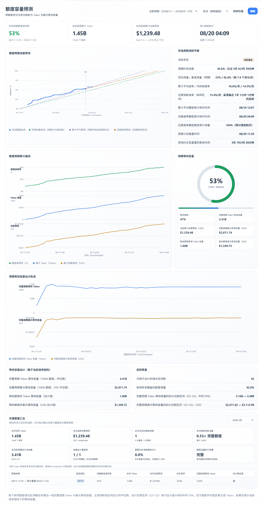

<p align="center">
  
</p>

# CPA Quota Estimator

<p align="center">
  <a href="./README.md"></a>
  <a href="./README.zh-CN.md"></a>
</p>

[](https://github.com/Autsunset/cpa-quota-estimator/actions/workflows/ci.yml)
[](https://github.com/Autsunset/cpa-quota-estimator/releases)
[](LICENSE)

一个原生 [CLIProxyAPI](https://github.com/router-for-me/CLIProxyAPI)（CPA）用量插件：记录实际发生的 Codex 额度周期，根据额度百分比增长估计 Token 与美元等效容量，并汇总定时重置及官方提前重置所形成的月度用量。

> OpenAI 没有公布 Codex 周额度对应的固定 Token 数或美元金额。本项目展示的是当前请求结构下的等效容量估计，并非官方标称额度。

<p align="center">
  
</p>

## 功能特性

- 监听 CPA 原生 `usage.handle` 事件，不发送探测请求，也不会额外消耗额度。
- 将 Token 数、模型、`service_tier`、估算费用和 `X-Codex-Primary-*` 额度元数据持久化到独立的 SQLite 数据库。
- 默认从 `https://models.dev/catalog.json` 同步 OpenAI 模型价格。
- 计算缓存读写、输出 Token，以及输入超过 272K Token 时的长上下文价格层级。
- 支持两种可配置的 Fast 定价方式：
  - `multiplier`：在普通或长上下文价格上应用倍数，默认 **2.5×**；
  - `source`：使用 models.dev 中明确提供的 `experimental.modes.fast.cost` 价格。
- 估计完整周期与剩余额度的 Token/美元等效容量，并提供四分位数区间和置信度。
- 展示实际额度轨迹、可持续基准、累计平均预测、近期速率预测、预计耗尽时间、计划重置时间和倒计时。
- 为每个已确认的额度周期建立独立账本；重置后，旧周期仍可在下拉框中选择和回看。
- 依据计划时间变化识别正常重置；当 `reset_at` 不变时，只有连续两个低用量观测一致，才确认发生提前重置，从而降低单个陈旧响应头造成的误分段。
- 增加自然月统计：实际 Token、请求估算费用、请求数、涉及周期数、已确认重置数、提前重置数、累计额度消耗当量、重置时未消耗额度，以及本月开始周期的估计总容量。
- 自动跟随官方 CPA 或 CPAMP 面板语言，支持中英文手动切换，并在浏览器中保存选择。
- 提供响应式嵌入式仪表盘，支持深色、浅色主题和移动端布局。
- 默认保留 365 天数据，不存储请求正文或响应正文。
- 可独立于 CPA Manager Plus（CPAMP）运行。

## 估算方法

对于同一额度周期内相邻的额度增长样本：

```text
完整周期 Token 等效容量 = ΔToken × 100 / Δ额度百分比
完整周期美元等效容量    = Δ费用 × 100 / Δ额度百分比
```

仪表盘取所有有效增长区间估计值的中位数，并用 P25–P75（Q1–Q3）表示不确定性区间。由于额度响应头通常只提供整数百分比，早期估计可能波动较大；随着已覆盖额度百分比增加，结果通常会逐渐稳定。

额度消耗预测会比较当前周期的时间进度和已用额度：

```text
时间进度       = 已经过秒数 / 周期总秒数
累计日均速率   = 已用额度百分比 / 已经过天数
重置时预计用量 = 已用额度百分比 / 时间进度
预计耗尽时间   = 周期开始时间 + 已经过时间 × 100 / 已用额度百分比
```

绿色线表示在重置时恰好达到 100% 的可持续基准速率；紫色线表示累计平均预测；橙色线表示近期约 24 小时的速率预测，近期样本不足时回退到累计平均预测。如果官方提前补充额度但 `reset_at` 没有改变，新周期会从首次确认的低用量观测开始，并以缩短后的剩余区间进行预测。

### 周期识别与月度统计口径

`reset_at` 表示上游计划的未来重置时间，本身不等同于“已经发生重置”。正常计划时间切换会结束上一周期；如果计划时间不变，但额度使用率突然回到接近 0%，插件会等待第二个一致观测，确认后再把首次低用量观测及其后的请求归入新周期。

自然月统计以 Asia/Shanghai 为边界：

- 实际 Token 和请求数按请求发生时间归属月份；请求费用依据 models.dev 价格估算，并按同一时间归属；
- 额度消耗当量是归属于该月的额度百分比增量之和，因此跨多个周期时可以超过 `100%` 或 `1.00×`；
- 重置次数和重置时未消耗额度只统计已确认的定时重置、提前重置及迁移得到的历史重置；
- 月度估计总容量汇总“在所选月份开始”的各周期完整容量中位数；它仍是当前请求结构下的等效估计，并非官方配额；
- 如果某个周期跨越月初，且月初之前没有可用于建立基线的样本，额度当量统计会标记为“部分覆盖”。

## 安装

### CPA 插件商店

插件被官方注册表收录后，可直接在 CPA 管理中心的**插件管理**页面安装。

### 手动安装

从 [GitHub Releases](https://github.com/Autsunset/cpa-quota-estimator/releases) 下载与运行平台匹配的压缩包，将其中的动态库解压到对应的 CPA 插件目录，例如：

```text
plugins/linux/amd64/cpa-quota-estimator.so
plugins/linux/arm64/cpa-quota-estimator.so
plugins/darwin/arm64/cpa-quota-estimator.dylib
plugins/windows/amd64/cpa-quota-estimator.dll
```

可在 `config.yaml` 中加入以下配置：

```yaml
plugins:
  configs:
    cpa-quota-estimator:
      enabled: true
      data_path: /CLIProxyAPI/data/cpa-quota-estimator.sqlite
      sample_interval_minutes: 5
      price_source_url: https://models.dev/catalog.json
      price_sync_interval_minutes: 1440
      fast_pricing_mode: multiplier
      fast_multiplier: 2.5
      long_context_threshold: 272000
      history_days: 365
  enabled: true
```

重启 CPA 后，日志中应出现：

```text
plugin registered plugin_id=cpa-quota-estimator plugin_name=CPA Quota Estimator
```

> **升级安全提醒：** 如果当前 AI 客户端通过 New API 和 CPA 访问上游，升级插件时不要停止 CPA 或 New API，也不要执行 `docker compose down`。应在服务保持运行时完成下载、校验、在线数据库备份和插件文件原子替换，最后只执行一次 CPA 重启并立即检查健康状态与插件注册日志。直接停止任一服务可能切断当前 AI 会话，使维护过程无法继续。

在管理中心打开**额度容量预测 / Quota Estimator**。如果宿主面板无法提供已认证的插件桥接，仪表盘会回退到 CPA Management Key 登录；密钥只保存在当前浏览器标签页的 `sessionStorage` 中。

> **冷启动说明：** 安装插件后并不会立即看到额度。插件完全被动，只记录真实流经 CPA 的请求，也无法回补安装之前的历史用量。首次真实的 Codex 请求之后，才会出现当前额度百分比和重置时间；只有当记录样本之间的额度百分比确实增长（Δ额度百分比 > 0）时，才开始计算容量估算。由于额度响应头只提供整数百分比，首个可用估算可能需要多次请求才会出现，并随着消耗累积逐渐稳定。

插件升级会原位迁移 SQLite 表结构，不会主动清空历史用量。使用 Docker 时，应通过 volume 或 bind mount 持久化 `data_path` 所在目录；默认目录是 `/CLIProxyAPI/data`。如果替换容器时没有挂载该目录，容器内的本地数据库也会随之被替换。

## Token 与费用计算规则

Token 图表使用输入 Token 与输出 Token 之和。缓存 Token 通常已经包含在输入 Token 中，因此不会重复相加；费用计算仍会单独应用缓存价格：

```text
缓存读取     = max(CacheReadTokens, CachedTokens)
非缓存输入   = max(InputTokens - 缓存读取 - 缓存写入, 0)

费用 = 非缓存输入 × 输入价格
     + 缓存读取 × 缓存读取价格
     + 缓存写入 × 缓存写入价格
     + 输出 × 输出价格
```

所有价格单位均为每一百万 Token 的美元价格。`ReasoningTokens` 已包含在输出 Token 中，不会重复计费。记录的 `service_tier` 为 `priority` 或 `fast` 时使用配置的 Fast 定价策略；`auto` 和 `default` 保持 1×。

## Management API

所有管理接口均受 CPA Management Key 保护：

| 方法 | 路径 | 用途 |
|---|---|---|
| GET | `/v0/management/cpa-quota-estimator/summary` | 所选额度周期与预测摘要 |
| GET | `/v0/management/cpa-quota-estimator/series` | 所选额度周期图表采样数据 |
| GET | `/v0/management/cpa-quota-estimator/monthly` | 自然月用量、重置与容量汇总 |
| GET | `/v0/management/cpa-quota-estimator/prices` | 已同步价格与 Fast 策略 |
| POST | `/v0/management/cpa-quota-estimator/prices/sync` | 立即触发 models.dev 价格同步 |
| GET | `/v0/resource/plugins/cpa-quota-estimator/dashboard` | 嵌入式仪表盘资源 |

使用 `?account=<AuthID>` 可选择指定凭证；在 `summary` 或 `series` 中使用 `?cycle_id=<ID>` 可选择历史周期；在 `monthly` 中使用 `?month=YYYY-MM` 可选择月份。

## 构建

需要 Go 1.22+、GCC 和 CGO：

```bash
make test
make build
make package VERSION=0.4.1
```

`make package` 会在 `dist/` 下生成兼容插件商店的压缩包和 `checksums.txt`。带版本标签的发布会通过 GitHub Actions 构建 Linux amd64/arm64、macOS amd64/arm64 和 Windows amd64 版本。

## 隐私

SQLite 数据库包含凭证标识符、模型名称、Token 数、估算费用、失败状态和额度元数据。它**不会**存储提示词、请求正文或响应正文。默认数据保留时间为 365 天。

## 可选的 CPAMP 授权桥接

本插件不依赖 CPAMP。自定义 CPAMP 部署可以通过受限的 `postMessage` 桥接复用现有登录状态，详见 [`docs/CPAMP_AUTH_BRIDGE.md`](docs/CPAMP_AUTH_BRIDGE.md)。无法使用桥接时，仪表盘会自动回退。

## 致谢

感谢 [CLIProxyAPI](https://github.com/router-for-me/CLIProxyAPI) 提供底层代理能力与原生插件机制。

感谢 [Linux.do 社区](https://linux.do/) 在测试、反馈与技术交流方面提供的支持。
